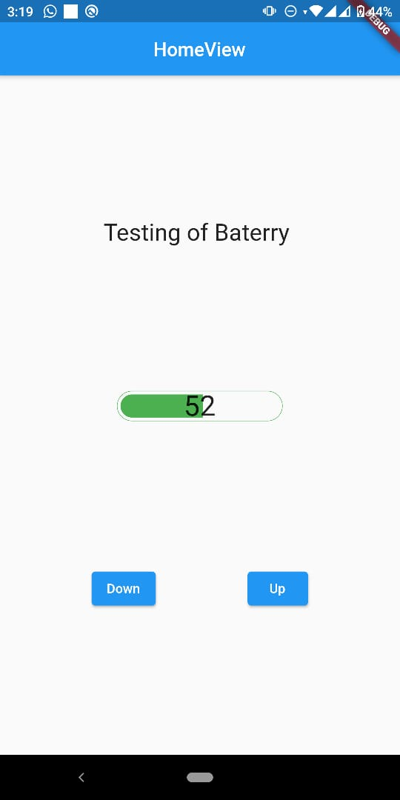
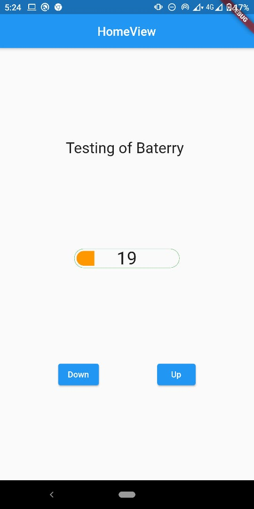

# custom_battery_indicator

A batterry indicator, the base was taken from https://github.com/debuggerx01/battery_indicator, and translated to GetX pattern https://pub.dev/packages/get.

## Screnshoots

